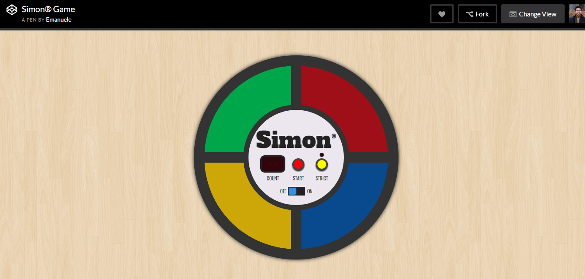
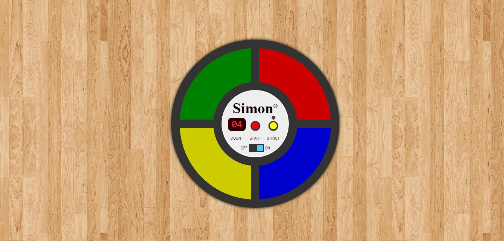

# Simon

Here's the interactive memory game from the 80's brought back to life in code! This was the final project of freeCodeCamp's Front End curriculum.

This was an exercise for me to really get down into the details of emulating a design, as well as creating a smooth user experience, and I must say I'm pretty proud of the result. You can try both below!

| Example Simon app from freeCodeCamp                                                   | My Simon app                                |
| ------------------------------------------------------------------------------------- | ------------------------------------------- |
|  |  |
